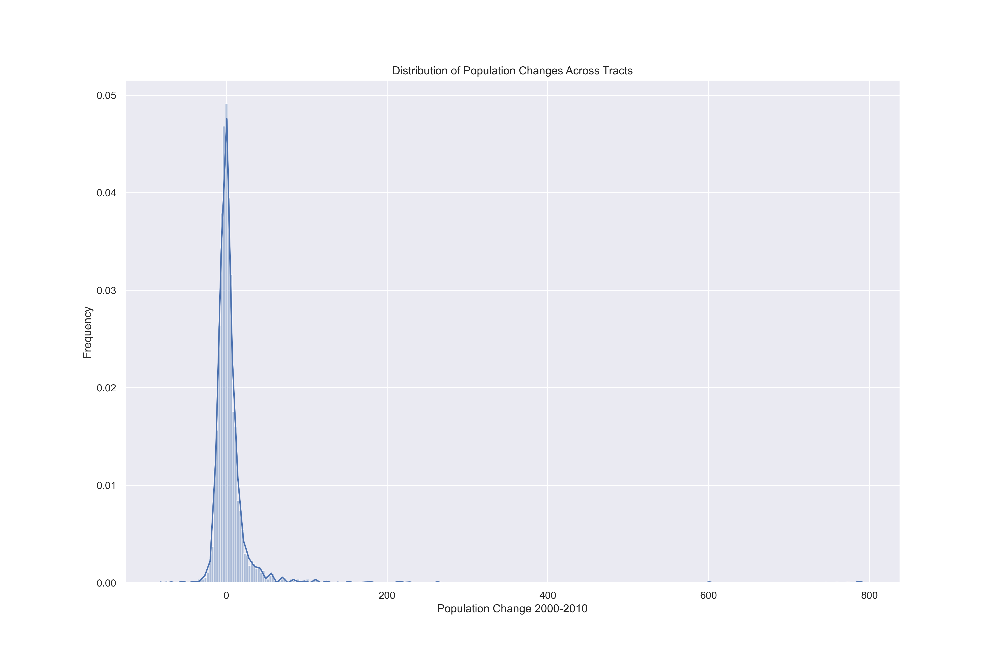
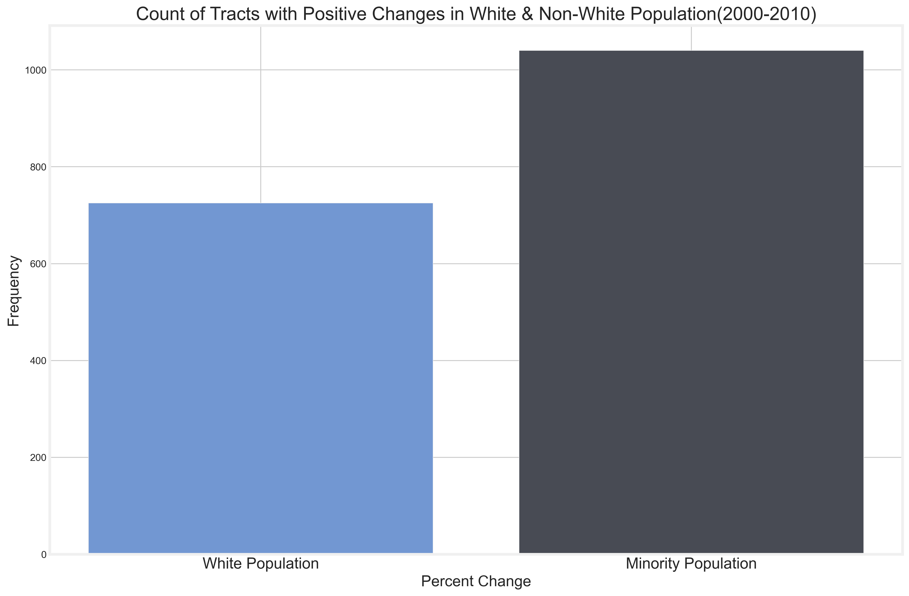
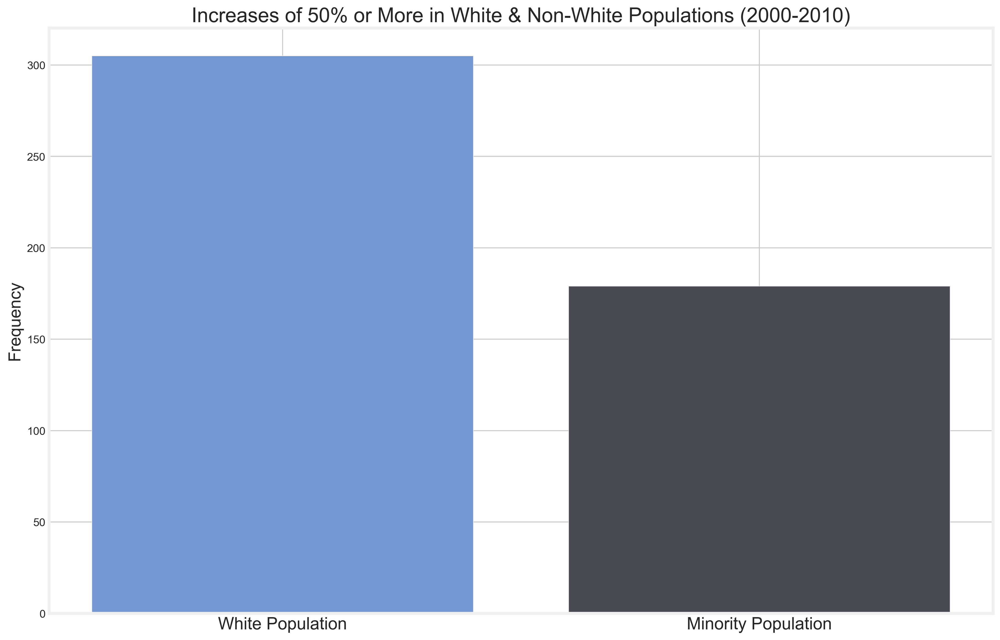
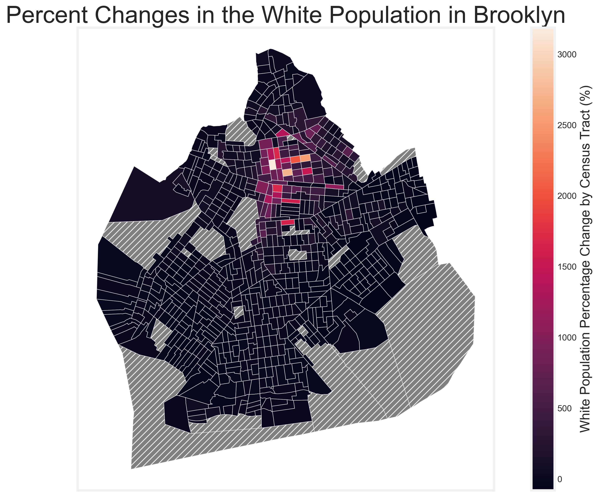
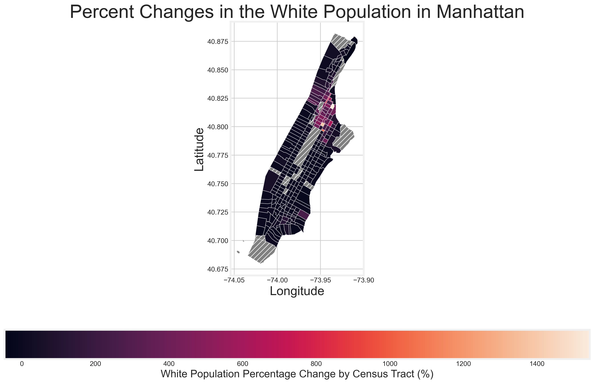
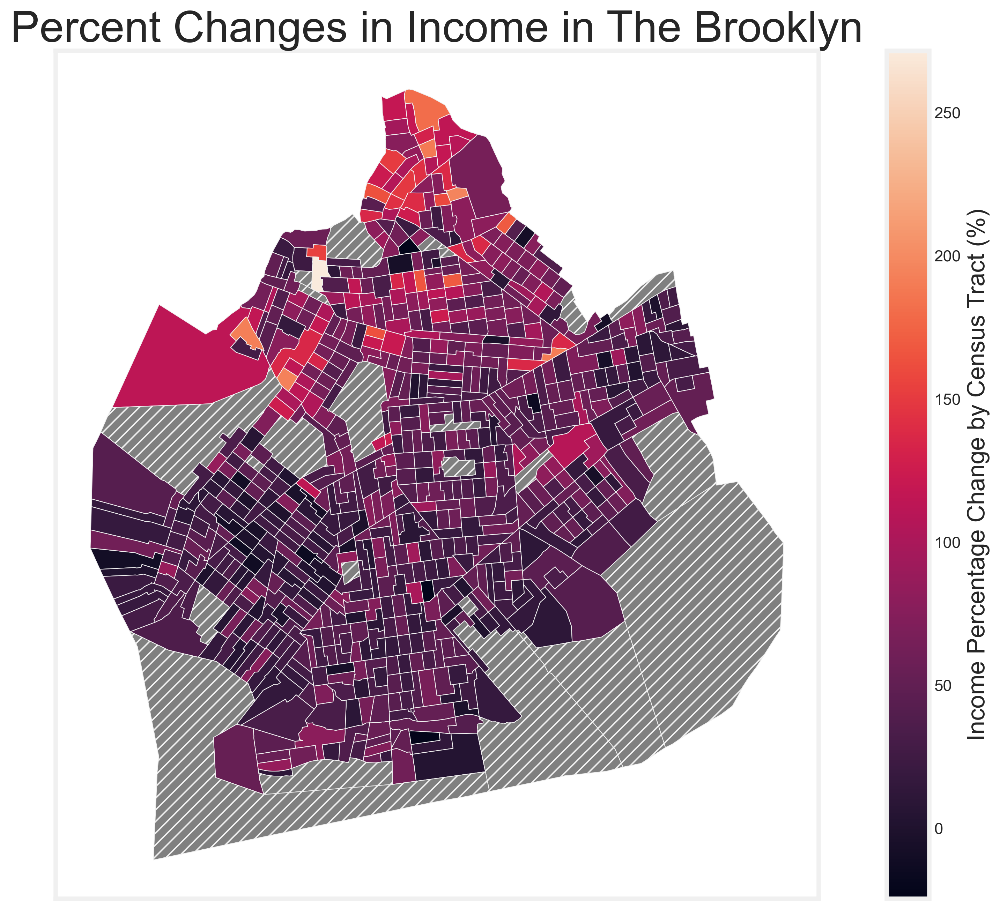
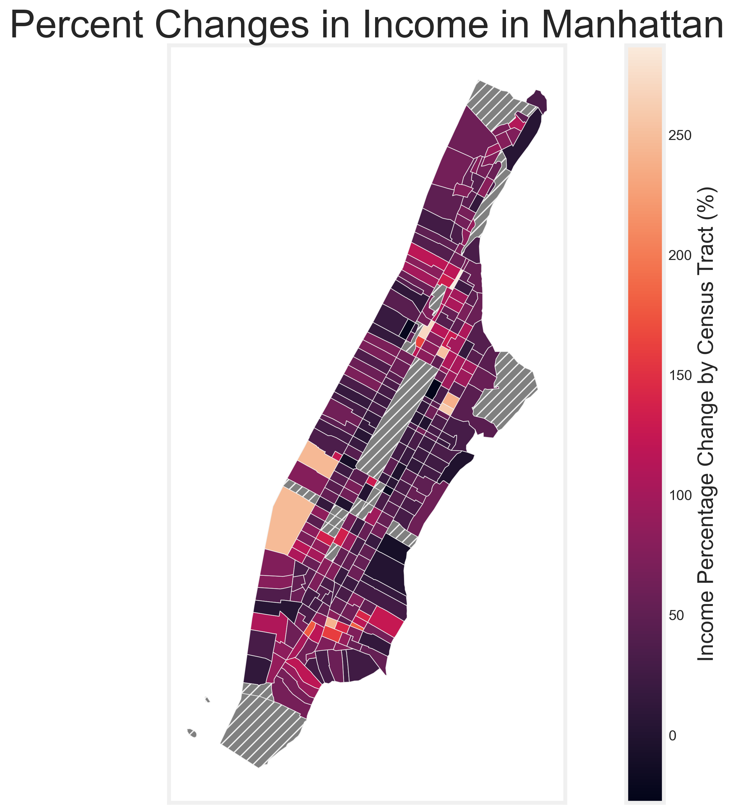
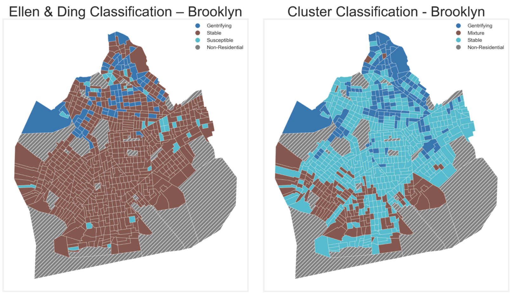
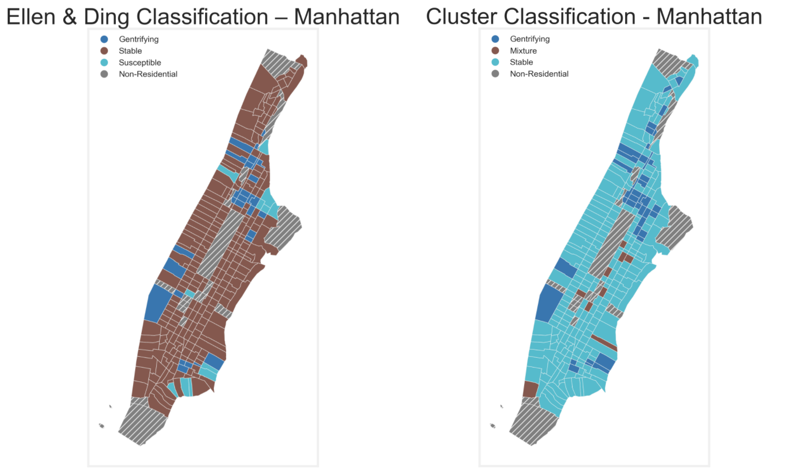

# Detecting Gentrification in the Neighborhoods of New York City
## By Paul Torres

## Project
The goal of this project is to build a model that will be able to detect which neighborhoods are undergoing the process of gentrification. 

The demographic makeup of neighborhoods in New York City can change dramatically in the years between the decennial national census'. Over the most recent decades, it has occurred because New York City has rebounded from the disastrous 1970's and areas have become desirable again. This means that what were once under served communities have become hot spots for development and expansion of upscale living. This phenomenon is known as gentrification. 

## Overview
Using compiled U.S. Census Data and American Community Survey Responses, I calculated the percentage change in each demographic category. These percent changes were then used to determine how the makeup of each census tract changed over the course of ten years from 2000 to 2010. 

Next, came the clustering of census tracts. Using the features, both given and engineered, I ran the observations through several algorithms in order to determine the best way to cluster them in order to determine gentrification status. 

## Repository Structure
- Images -- contains images created during EDA and those linked in README
- 01_Data_Cleaning_Processing -- contains all of the data cleaning steps and techniques with markdowns explaining reasoning
- 02_EDA -- exploring all of the features and how they affect each other. 
- 03_Clusters -- contains all the code that determine the gentrification level of census tracts while looking at other census tracts with similar feature levels
- 04_Evaluation -- on a parallel track, determining the gentrification level using predetermined metrics established in academic papers. These metrics will be the real values with which I compare my algorithm

## Business Case
Gentrification leads to displacement of whole communities that are under represented in local politics and most at risk for poverty related complications. A model that can identify a neighborhood at risk for gentrification would allow interested groups to reallocate resources to prevent displacement. A method that would be able to do so with the provided data would be helpful to community groups and government agencies to help those at risk for displacement.

- Who would this model serve?  
        1. Stakeholders include residents that are in areas that are susceptible to gentrification.  
        2. Community groups that exist to empower residents to battle gentrification.  
        3. Government agencies tasked with keeping housing affordable in under served communities.  

- What does this model take into account?  
        1. The model tracks the trends in neighborhoods that have gentrified and compares them with current neighborhoods.  
        2. While full counts of demographics may seem useful, it is actually more important to use the percent changes of each of the demographic categories.  
        3. Through feature selection and determining feature importance, I will try and conclude what changes in the demographic is more important in determining gentrification. 

## Data
The data used to determine the classifications was obtained from Longitudinal Tract Database (LTDB) and the United States Census Bureau. Both full count data and sample data was used in this project. 

## Preprocessing (Data Cleaning & Feature Engineering)

Standard data cleaning in order to fill in missing values, dispose of observations that were heavily flawed, and remove observations that did not include residential areas but were in fact parks, prisons, or heavily commercial areas.  
  
The next step was to change the actual counts of the data to percentage counts. This included calculating the percentage each demographic and housing type existed in each census tract. This process was repeated for the full count and sample data for both 2000 & 2010.  
  
Finally, I created percent changes between the two census years. The increase or decrease of a sub-group is the most important for gentrification metrics. 

## Exploratory Data Analysis

First, we took a cursory glance at the distribution of population changes from 2000 to 2010. 

As you can see, the distribution is centered about zero with tails on either side. There are a lot more extreme outliers in the positive direction. 

While informative about the overall population growth, it doesn't speak on the make up of the different census tracts. First, we take a look at the changes based on race. For clarity, we grouped non-white populations together. 

The graph above is a count of all of the census tracts that have seen an increase in white and non-white populations. From this data, we see that there is an increase in non-white populations in more census tracts –– which goes against what you would expect from a gentrifying city. However, let's raise the bar. 

From the graphic on the left, we can see that when the bar raises from any increase to 50% or more there is a large difference in the amount of white vs non-white populations. We should take this to mean that while there are small increases in non-white populations across the census tracts, there is a more focused increase to certain areas for white populations.

### Metric 

There are a range of metrics that are generally accepted as being indicators of gentrification in neighborhoods. These metrics can be found in this [report](https://www.enterprisecommunity.org/download?fid=10224&nid=7602). Which has compiled different studies on gentrification and what they considered to be the signs gentrification. 

**Signs of Gentrification**
- Change in the white population beyond the median
- Change in family income beyond the median
- Change in college graduates beyond the median
- Change in poverty rate beyond the median

Below we will examine some graphics on these metrics.

### Change in Racial Makeup

Below you can see the change in the white population in Brooklyn and Manhattan.

Both maps show an increase in neighborhoods that were predominantly minority neighborhoods. Harlem in Manhattan and Bedford-Stuyvesant in Brooklyn.

### Income Level Changes

Below you can see the change in income from 2000 to 2010 in Brooklyn and Manhattan.

Most interesting to see is the incredible increase in **Hell's Kitchen** in Manhattan. What was previously train yards and undeveloped land is now luxury buildings. 

## Clustering

The data is unlabeled and as such is subject to unsupervised learning. I've employed several clustering algorithms using the entire set of features from the data. As well as different subsets that use metrics that gentrification is usually based upon. 

Methods to cluster included:

- Principal Components (KMeans)
- Hierarchical Clustering
- KMeans Clustering

### Feature Subset 1

These features included:

- Family Income
- Home Value
- College Graduates
- Monthly Rent
- Home Ownership
- Non-White Population

### Feature Subset 2
Same as Subset 1 but also: 

- White Population

### Feature Subset 3
Same as Subset 2 but also:

- Non-White Poverty Population

### Scoring Cluster Creation

In order to determine whether a cluster was viable, we used it's silhouette score. A silhouette score is the determination of the distance between points in a cluster against the distance to another cluster. 

|Model | Silhouette Score|
|-|-|
|Hierarchical|0.03|
|Hierarchical - Subset 1| 0.04|
|PCA - Subset 1|0.42|
|PCA - Subset 2|0.43|
|KMeans |0.07|
|KMeans - Subset 2|.40|

# Cluster Descriptions

The clustering algorithm used the percent changes of the different census tracts to group them together. Using only the best model, which was the PCA - Subset 2, as a guide – the clustering configuration was set at 3. Due to the limitations on the subset, it only took into account the final state of the census tracts. This means that there was no identification of potential change only identification of past change. 

Clustering is based on unsupervised learning so there were no labels given to the data. So the algorithms had to take into consideration the features provided and make clusters based on them. This means that the clusters are only based on the data provided and does not necessarily look forward.

# Academic Studies and Comparisons

Gentrification has been studied by anthropologists and urban designers in specific since the 1960's. Many have come up with metrics to use to determine if a neighborhood is vulnerable to gentrification of if it is currently undergoing gentrification. 

We will be using one of the most recent studies by Ellen & Ding (2016) titled *Advancing Our Understanding of Gentrification*. In it they lay out metrics to be applied to census tracts. However, while the clusters look at the census tracts as a snapshot – the metrics used by *Ellen & Ding* look towards possibilities. 

  

  

As you can see there is difference in the goals of the two maps is the **Stable** classification for the cluster and the 

#### Potential to Gentrify
- Mean family income falls below 40th percentile of metropolitan area

#### Currently Gentrifying (From Start to End Date)
At least a 10 point increase in ratio of census tract median to city median of:
- Average family income
- White Population
- College Educated Residents
- Median Monthly Rent

## Comparing Algorithm to the Academic Metrics

# Further Recommendations 

Gentrification leads to many complications that affect the most vulnerable at incredibly disproportionate rates. Using a model such as this – communities, activist groups, and even government agencies can help those in most need of affordable housing options. 

# Next Steps

The next thing that would contribute to this project would be the introduction of more recent data that can bring attention to neighborhoods that are currently going through this process. 

The introduction of more recent data would allow us to take a closer look at the Bronx. Which is the least gentrified borough as of the current time. 

